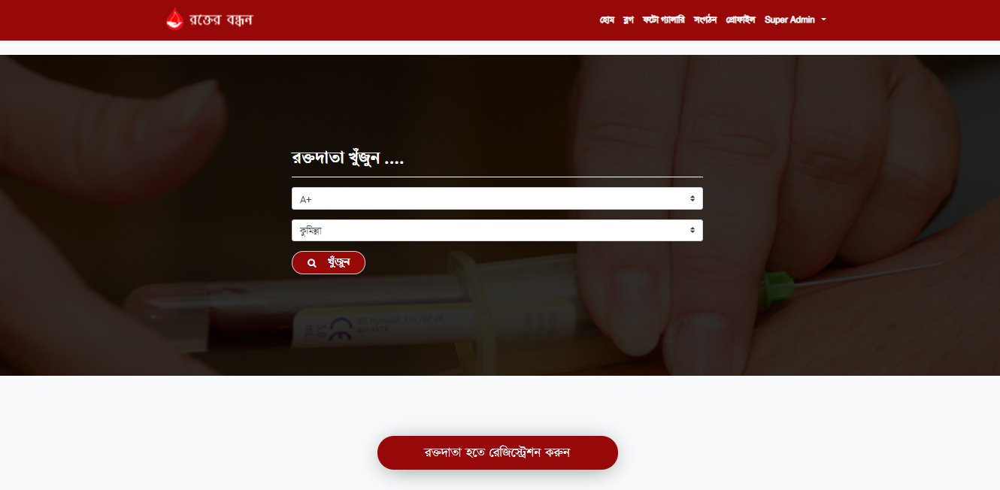

## About Rokterbondhon

This project is designed for successful completion of a project on blood bank management system.
The basic building aim is to provide blood donation service to the city recently. Blood Bank Management System (BBMS) is a Web-based application that is designed to store, process, retrieve and analyze information concerned with the administrative and inventory management within a blood bank.

This project aims at maintaining all the information pertaining to blood donors, different blood groups available in each blood bank and help them manage in a better way.

<h2>Developed with  Laravel</h2>

By 

## License

The Laravel framework is open-source software licensed under the [MIT license](https://opensource.org/licenses/MIT).
